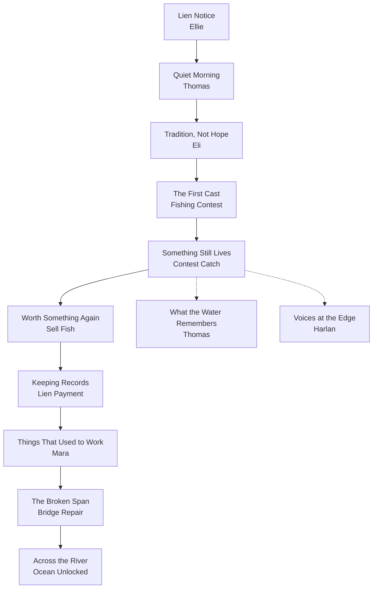

## Act 1 
|#|Quest Name|NPC|Quest Type|What the Player Does|Story Purpose|Gameplay Unlock|
|---|---|---|---|---|---|---|
|1|**The Lien Notice**|Ellie|Main|Read the lien notice, talk to Ellie|Establishes core motivation and stakes|Lien tracker UI|
|2|**Old Waters**|Eli|Main|Fish in the river for the first time|Reconnects player to fishing|Fishing unlocked|
|3|**Tradition, Not Hope**|Thomas|Main|Attend / enter fishing contest|Introduces town nostalgia|Fishing contest|
|4|**A Modest Win**|Eli|Main|Catch fish during contest|First proof the waters still respond|Guaranteed early catch|
|5|**Worth Something Again**|Lena|Main|Sell fish, make first lien payment|Establishes economy loop|Sell fish, lien payment|
|6|**Things That Used to Work**|Mara|Side (Required)|Collect materials for small repairs|Shows rebuilding is possible|Minor town repair|
|7|**Voices at the Edge**|Harlan|Optional|Fish in an odd spot, talk to Harlan|Seeds mystery & unease|Rune foreshadowing|
|8|**Keeping Records**|Ellie|Main|Pay second lien milestone|Reinforces visible progress|NPC dialogue shifts|
|9|**What the Water Remembers**|Thomas|Side|Ask townsfolk about the past|Introduces legendary fisherman|Lore unlocked|
|10|**The Broken Span**|Mara|Main|Help repair the bridge|Physical world progression|Bridge repair begins|
|11|**One More Payment**|Lena|Main|Earn enough to fund repairs|Ties economy to world change|Bridge materials|
|12|**Across the River**|Eli|Main|Witness bridge reopening|Marks end of starter biome|Ocean access unlocked|

